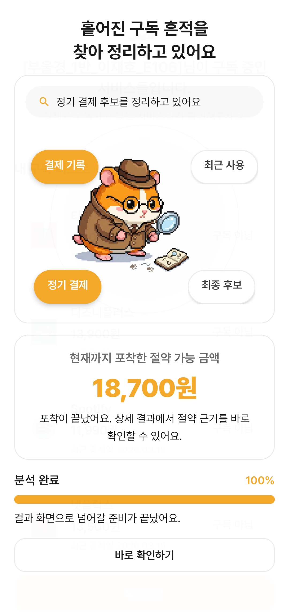
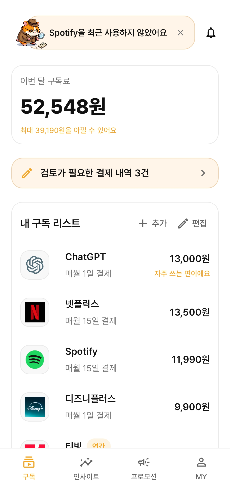
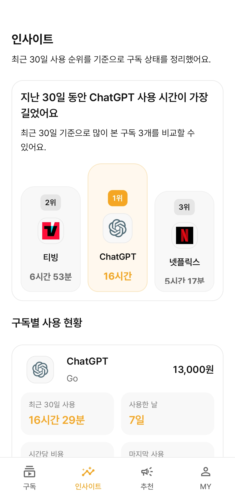
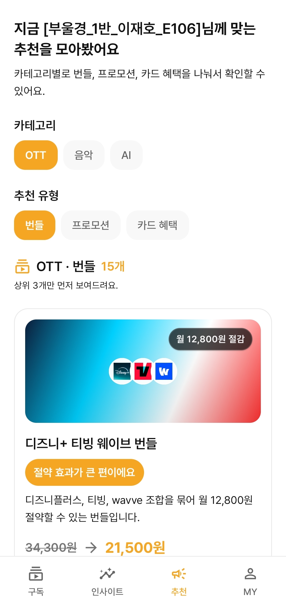
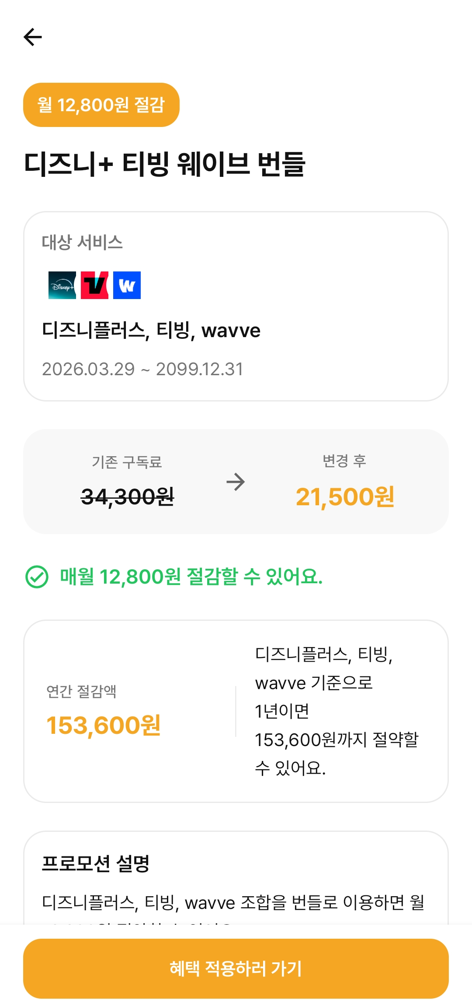
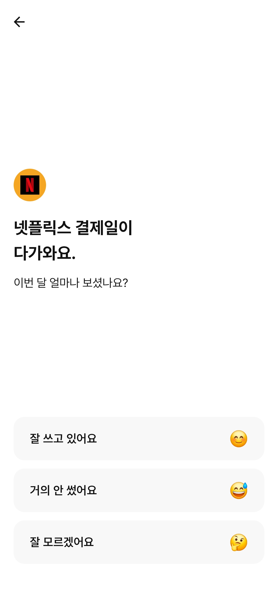

<div align="center">

# 애낌 (AEKKIM)


**결제 내역과 사용 이력을 바탕으로 구독을 정리하고,**  
**추천 혜택과 체크인 알림으로 불필요한 지출을 줄이도록 돕는 구독 관리 서비스**

<br/>

 **SSAFY 14기 부울경 특화프로젝트 우수 프로젝트 선정**

<br/>


</div>

---

## | 서비스 소개

구독 서비스는 한 번 가입하면 해지 시점을 놓치기 쉽고, 실제 사용량과 무관하게 결제가 이어지는 경우가 많습니다.

애낌은 결제 내역과 앱 사용 이력을 함께 활용해 현재 구독 상태를 정리하고, 추천 혜택과 체크인 알림을 통해 실제 절감 행동까지 이어지도록 설계한 Android 기반 서비스입니다.

---

## | 기술 스택

<table>
  <tr>
    <th align="center">Category</th>
    <th align="center">Stack</th>
  </tr>
  <tr>
    <td align="center"><strong>Backend</strong></td>
    <td align="center">
      
      
      
      
      
    </td>
  </tr>
  <tr>
    <td align="center"><strong>Frontend</strong></td>
    <td align="center">
      
      
      
      
    </td>
  </tr>
  <tr>
    <td align="center"><strong>AI / Data</strong></td>
    <td align="center">
      
      
      
      
      
    </td>
  </tr>
  <tr>
    <td align="center"><strong>Database / Cache</strong></td>
    <td align="center">
      
      
    </td>
  </tr>
  <tr>
    <td align="center"><strong>Notification</strong></td>
    <td align="center">
      
    </td>
  </tr>
  <tr>
    <td align="center"><strong>Infra</strong></td>
    <td align="center">
      
      
      
      
    </td>
  </tr>
</table>

<br/>

---

## | 팀원 소개

<table>
  <tr>
    <td align="center">
      <b>이재호</b><br/>
      <sub>팀장</sub><br/><br/>
      
      
    </td>
    <td align="center">
      <b>김응서</b><br/>
      <sub>팀원</sub><br/><br/>
      
      
    </td>
    <td align="center">
      <b>김지윤</b><br/>
      <sub>팀원</sub><br/><br/>
      
      
      
    </td>
    <td align="center">
      <b>박규빈</b><br/>
      <sub>팀원</sub><br/><br/>
      
      
    </td>
    <td align="center">
      <b>백수연</b><br/>
      <sub>팀원</sub><br/><br/>
      
    </td>
  </tr>
</table>

---

## | 시스템 아키텍처

<div align="center">
  
</div>

<br/>

| 구성 요소 | 설명 |
|-----------|------|
| **Android App** | 온디바이스 AI와 함께 백엔드 API를 호출해 구독 분석 · 추천 · 체크인 흐름을 처리 |
| **Backend** | Nginx 리버스 프록시 뒤에서 dev / prod 환경 분리 운영, MySQL(영속) + Redis(캐시) |
| **AI / Data** | Python 스크래퍼로 OTT · 프로모션 · 카드 혜택 수집, Spring Batch로 알림 자동화 |
| **외부 연동** | Google OAuth · FCM · OpenAI |
| **배포** | `GitLab` → `Jenkins` → `Docker Hub` → `EC2` |

---

## | MVP 기능

<table>
  <tr>
    <td align="center" width="33%">
      <br /><br />
      <strong> 구독 분석</strong><br />
      <sub>결제 기록과 최근 사용 흐름을 바탕으로 정기 결제 후보와 절감 가능 금액을 확인합니다.</sub>
    </td>
    <td align="center" width="33%">
      <br /><br />
      <strong> 구독 통합 관리</strong><br />
      <sub>현재 구독 중인 서비스와 결제일, 금액을 한곳에서 조회하고 직접 관리할 수 있습니다.</sub>
    </td>
    <td align="center" width="33%">
      <br /><br />
      <strong> 사용 인사이트</strong><br />
      <sub>최근 사용 순위와 사용 시간, 비용 대비 사용량을 기반으로 구독 상태를 다시 점검할 수 있습니다.</sub>
    </td>
  </tr>
  <tr>
    <td align="center" width="33%">
      <br /><br />
      <strong> 추천 혜택 탐색</strong><br />
      <sub>카테고리와 추천 유형별로 번들, 프로모션, 카드 혜택을 나눠 확인할 수 있습니다.</sub>
    </td>
    <td align="center" width="33%">
      <br /><br />
      <strong> 혜택 상세 확인</strong><br />
      <sub>월 절감 금액과 연간 절감 효과를 비교해 실제로 적용할 혜택을 판단할 수 있습니다.</sub>
    </td>
    <td align="center" width="33%">
      <br /><br />
      <strong> 체크인 유도</strong><br />
      <sub>결제일 전 사용 여부를 다시 확인해 저사용 구독을 정리하도록 돕습니다.</sub>
    </td>
  </tr>
</table>

---

## | 저장소 구조

```text
.
├── FE/                         # Android 앱
│   ├── app/                    # 앱 코드 및 리소스
│   ├── docs/                   # FE 운영 / 유지보수 문서
│   └── Mock-up/                # 화면 시안 및 목업
├── BE/                         # Spring Boot 백엔드
│   ├── src/main/java/          # 도메인별 API, 서비스, 공통 설정
│   ├── src/main/resources/     # application.yml, 정적 리소스
│   └── docs/                   # BE 관련 문서
├── AI/                         # 데이터 수집 및 생성 스크립트
│   ├── scraper/                # OTT / 프로모션 / 카드 혜택 수집
│   ├── data_generator/         # 샘플 데이터 생성
│   └── docs/                   # AI 관련 문서
├── INFRA/                      # 배포 및 운영 설정
│   ├── nginx/                  # Nginx 설정
│   └── docker-compose.*.yml    # dev / prod 실행 구성
├── docs/                       # 요구사항, 화면명세, API 문서
│   └── api/                    # 도메인별 API 명세
├── docker-compose.yml          # 루트 로컬 백엔드 스택
├── Jenkinsfile                 # CI/CD 파이프라인
└── .env.example                # 환경 변수 템플릿
```

---

## | 문서 바로가기

### Overview

<table>
  <tr>
    <th align="left" bgcolor="#f0f0f0">문서</th>
    <th align="left" bgcolor="#f0f0f0">경로</th>
  </tr>
  <tr bgcolor="#f8f8f8">
    <td>Frontend README</td>
    <td><a href="FE/README.md">FE/README.md</a></td>
  </tr>
  <tr>
    <td>Backend README</td>
    <td><a href="BE/README.md">BE/README.md</a></td>
  </tr>
  <tr bgcolor="#f8f8f8">
    <td>AI README</td>
    <td><a href="AI/README.md">AI/README.md</a></td>
  </tr>
  <tr>
    <td>API 문서</td>
    <td><a href="docs/api">docs/api</a></td>
  </tr>
</table>

### Service

| 문서 | 경로 |
|------|------|
| 요구사항 정의서 | [docs/2026-03-21_요구사항정의서_v2_AEKKIM.md](docs/2026-03-21_요구사항정의서_v2_AEKKIM.md) |
| 화면 명세서 | [docs/2026-03-21_화면명세서_v2_AEKKIM.md](docs/2026-03-21_화면명세서_v2_AEKKIM.md) |

### Data & History

| 문서 | 경로 |
|------|------|
| DB ERD | [BE/docs/2026-03-20_DB_ERD.md](BE/docs/2026-03-20_DB_ERD.md) |
| 주요 변경사항 | [docs/2026-03-24_주요_변경사항.md](docs/2026-03-24_주요_변경사항.md) |

### Collaboration

| 문서 | 경로 |
|------|------|
| 브랜치 전략 | [docs/2026-03-03_깃_브랜치_전략.md](docs/2026-03-03_깃_브랜치_전략.md) |
| 커밋 메시지 컨벤션 | [docs/2026-03-03_커밋메시지_컨벤션.md](docs/2026-03-03_커밋메시지_컨벤션.md) |
| Jira 컨벤션 | [docs/2026-03-09_지라_컨벤션.md](docs/2026-03-09_지라_컨벤션.md) |

---

## | 실행 및 상세 안내

| 구분 | 안내 | 경로 |
|------|------|------|
| Frontend | 앱 실행 및 빌드 가이드 | [FE/README.md](FE/README.md) |
| Backend | 백엔드 실행 및 환경 변수 가이드 | [BE/README.md](BE/README.md) |
| AI | AI 파이프라인 문서 | [AI/README.md](AI/README.md) |
| Frontend Docs | FE 운영 / 유지보수 문서 | [FE/docs/README.md](FE/docs/README.md) |
| Infra | 배포 및 운영 설정 | [INFRA](INFRA) |